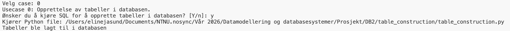
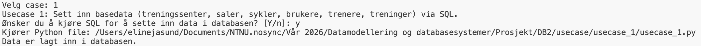
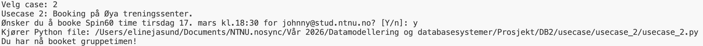
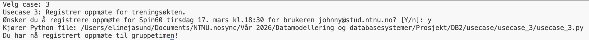
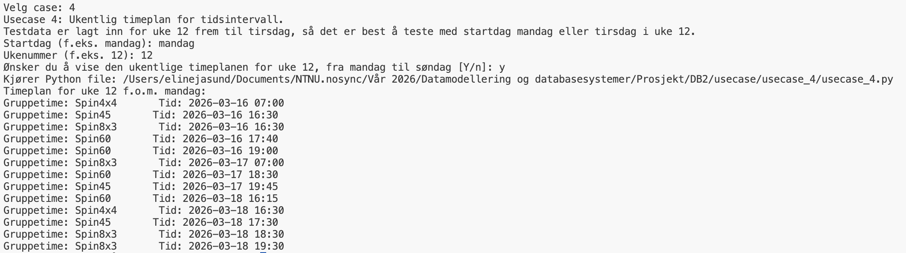
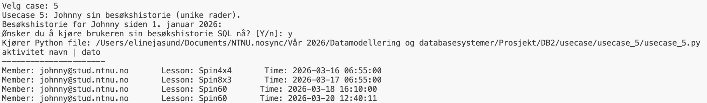
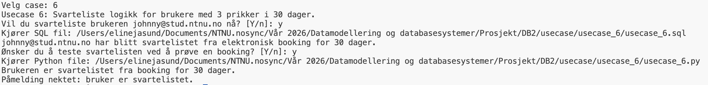
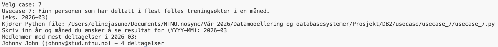
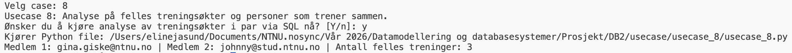

# TreningDB Gruppe 134
Dette prosjektet inneholder Python og SQL filer for å konstruere og bruke en DB Browser for SQLite i forbindelse med prosjektet for TDT4145 Datamodellering og databasesystemer. Prosjektet modellerer en database for SiT Trening i Trondheim og har implementert kode for å fullføre flere ulike brukertilfeller.

## Filstruktur
```text
TreningDB/
├── images/
│   ├── usecase_0_result.png
│   ├── usecase_1_result.png
│   ├── usecase_2_result.png
│   ├── usecase_3_result.png
│   ├── usecase_4_result.png
│   ├── usecase_5_result.png
│   ├── usecase_6_result.png
│   ├── usecase_7_result.png
│   └── usecase_8_result.png
|
├── table_construction/
│   ├── table_construction.py
│   └── table_construction.sql
│
├── usecase/
│   ├── usecase_1/
│   │   ├── usecase_1.py
│   │   └── usecase_1.sql
│   │
│   ├── usecase_2/
│   │   ├── usecase_2.py
│   │   └── usecase_2.sql
│   │
│   ├── usecase_3/
│   │   ├── usecase_3.py
│   │   └── usecase_3.sql
│   │
│   ├── usecase_4/
│   │   └── usecase_4.py
│   │
│   ├── usecase_5/
│   │   └── usecase_5.py
│   │
│   ├── usecase_6/
│   │   ├── usecase_6.py
│   │   └── usecase_6.sql
│   │
│   ├── usecase_7/
│   │   ├── usecase_7.py
│   │   └── usecase_7.sql
│   │
│   └── usecase_8/
│       ├── usecase_8.py
│       └── usecase_8.sql
│
├── .gitignore
├── README.md
├── TreningDB.db
└── usecase_interface.py
```

## Brukstilfeller implementert

1. Opprette tabeller for treningssenter, saler, fasiliteter, brukere, gruppetimer og mer (Python + SQL).

2. Booke Spin60 for Johnny (Python + SQL).

3. Registrere oppmøte av Spin60 for Johnny (Python + SQL).

4. Ukeplan for alle treninger i en gitt uke (Python + SQL).

5. Personlig besøkshistorie for Johnny (SQL).

6. Svartelisting av Johnny etter å få tre prikker innen 30 dager (Python + SQL).

7. Finne brukere med flest gruppetimer i en måned (Python + SQL).

8. Finne to brukere som trener sammen (SQL).

Alle brukstilfeller er implementert i SQL, med Python-filer i tilegg der oppgaven krever det eller for å enkelt lese og kjøre SQL-filene.

## Hvordan kjøre database applikasjonen
### Krav til programvare

- Python 3.8 eller nyere

- Ingen eksterne biblioteker kreves (kun standardbiblioteket sqlite3)

Database-applikasjonen er tekstbasert og kjøres i terminalen dersom man kjører *usecase_interface.py* på følgende vis:
```python
python3 usecase_interface.py
```

Brukeren presenteres da med en meny der man kan velge hvilket brukstilfelle man ønsker å kjøre.

Når man har valgt brukstilfellet man ønsker å kjøre, vil man i mange av tilfellene få valget:
```python
"Ønsker du å gjøre dette? [Y/n]"
```

Her vil det være tilstrekkelig å trykke *Enter* dersom man ønsker å svare "Y", for "yes".

Database-filen [TreningDB.db](TreningDB.db) lagt ved i dette prosjektet er tom og for å bygge opp databasen må man utføre alle valgenen i menyen. Menyen består av valg fra 0-8, for at applikasjonen skal kjøre uten feil anbefales det å kjøre valgene i stigende rekkefølge.

Alle brukstilfellene krever at du bekrefter valget ditt, og noen ønsker at du skriver inn spesifikke krav for utføringen. Dette skrives direkte i terminalen der applikasjonen kjøres. Brukstilfellet vil forklare formatet du behøver å skrive på for å tilfredstille kravene til funksjonene.

Dersom man har kjørt alle brukstilfellene eller ønsker å starte databasen på nytt, kan man kjøre brukstilfelle 0. Dette vil tilbakestille alle tabellene til å være tomme.

### Brukstilfelle 0
Vi har valgt å legge til *Brukstilfelle 0* for å gi bruker mulighet til å lage de de tomme tabellene i databasen. Dette er gjort separat ifra å legge inn dataen i databasen slik at bruker kan gjøre Brukstilfelle 0 dersom de ønsker å tømme databasen fra data.

*For at applikasjonen skal kjøre må brukstilfelle 0 kjøres først*


*Resultat av å kjøre brukertilfelle 0*

### Brukstilfelle 1
Brukstilfelle 1 fyller databasen med eksempeldata som forklart i brukstilfellet.


*Resultat av å kjøre brukertilfelle 1*

### Brukstilfelle 2
Ved å kjøre brukstilfelle 2 booker man en Spin60 time for Johnny tirsdag 17. mars kl. 18:30. Output vil her være en bekreftelse på at bookingen er gjennomført. Dersom man prøver å booke en time før eksempeldataen er satt inn vil man få en feilmelding.


*Resultat av å kjøre brukertilfelle 2*

### Brukstilfelle 3
I brukstilfelle 3 registrerer man oppmøte for Johnny på gruppetimen fra brukstilfelle 2. Dersom man prøver å registrere oppmøte før man har booket timen hans vil man få en melding om at registreringen ikke kunne gjennomføres fordi man ikke er påmeldt timen.


*Resultat av å kjøre brukertilfelle 3*

### Brukstilfelle 4
Ved å velge brukstilfelle 4 vil man kunne se en ukentlig timeplan for gitt tidsperiode. Inputen man skal gi her er for eksempel *mandag* og *12* som vil vise dataen i fra mandag til søndag i uke 12.

Som det står forklart når man kjører dette brukstilfellet er det kun lagt inn eksempeldata for mandag og tirsdag i uke 12, og ved å velge andre dager enn dette vil man ikke få noen resultater.


*Resultat av å kjøre brukertilfelle 4*

### Brukstilfelle 5
Brukstilfelle 5 viser besøkshistorien til Johnny.


*Resultat av å kjøre brukertilfelle 5*

### Brukstilfelle 6
I brukstilfelle 6 testes funksjonaliteten for å svarteliste et medlem. Etter man har valgt å svarteliste Johnny ved å gi han 3 prikker kan man velge å prøve å booke en time for han for å se at svartelistingen har blitt implementert.


*Resultat av å kjøre brukertilfelle 6*

### Brukstilfelle 7
Brukstilfelle 7 gir de medlemmene som har deltatt på flest gruppetimer i den gitte måneden. For å kjøre denne anbefales det å skrive følgende:

*2026-03*

Det er i denne perioden det er mest eksempeldata å basere spørringen på.


*Resultat av å kjøre brukertilfelle 7*

### Brukstilfelle 8
Ved å kjøre brukstilfelle 8 får man vite hvilke medlemmer som trener sammen, og hvor mange treninger de har vært på sammen.

For å løse denne oppgaven valgte gruppen å sjekke hvilke to medlemmer som har ankommet senteret sammen (innenfor 1 minutt av hverandre) mer enn 3 ganger de siste 3 månedene.


*Resultat av å kjøre brukertilfelle 8*

## Merknader til implementasjon av databasen
* Det er ikke implementert kontroll av dato og tidspunkt for booking eller registrering av oppmøte før operasjonene utføres. Dette er et bevisst valg, ettersom det er usikkert når brukeren vil kjøre brukstilfellene og vi bruker nåværende dato for disse tilfellene. Vi ønsket å unngå feilmeldinger dersom det forsøkes å melde seg på eller registrere oppmøte utenfor de definerte tidsfristene. Dersom vi kunne forutsatt at brukeren kun interagerer med systemet innenfor gyldige tidsrom, ville slike kontroller blitt implementert i Python filene, på samme måte som andre ugyldige tilfeller håndteres.
* Dersom brukertilfelle spesifiserte at handlingen skulle håndtere et tilfelle for Johnny har vi valgt at tekstapplikasjonen kun skal utføre dette for Johnny, selv om fler av python filene tillater å utføre handlingen for ulike brukere. Dette er gjort slik at det er lett for brukere å utføre handlingen uten å måtte skrive inn informasjon angående gruppetimer eller brukere. 

## Endringer gjort i skjema fra første innlevering
- La til time_booked i group_lesson_booking. Denne endringen viste seg å ikke være nødvendig, men ble gjennomført på grunn av en misforståelse av oppgavebeskrivelsen. Endringen ble beholdt da dette ikke forstyrrer BCNF formatet og gjorde group_lesson_booking og group_lesson_registration mer uniforme.
- Ingen andre endringer

## KI deklarasjon
Det er brukt KI-verktøy i prosjektet, vi har brukt ChatGPT og Copilot


Må ha deklarasjon på alt som er generert av KI

Brukt ChatGPT og Copilot

Brukt til
- interface
- debugging -> gjort eventuelle endringer selv, bare brukt for å finne bug
- hjelpe med å formatere strenger til query, særlig mtp datetime
- usecase 2 og 3, skrev først hardkodede verdier, men ønsker senere å ha en interaktiv versjon, brukte da Chat til å finne stedene i koden der vi refererte til Johnny og heller gi den en ukjent variabel, men måtte selv endre hvilke verdier de variablene skulle referere til
- fikk generert eksempeldata på sykler, fordi det er veldig mange av dem, og fasiliteter (basert på Sits nettside)

## Gruppeinformasjon
Gruppenummer: 134

Gruppemedlemmer: Eline Jåsund, Gina Giske, Catrin Johansen 